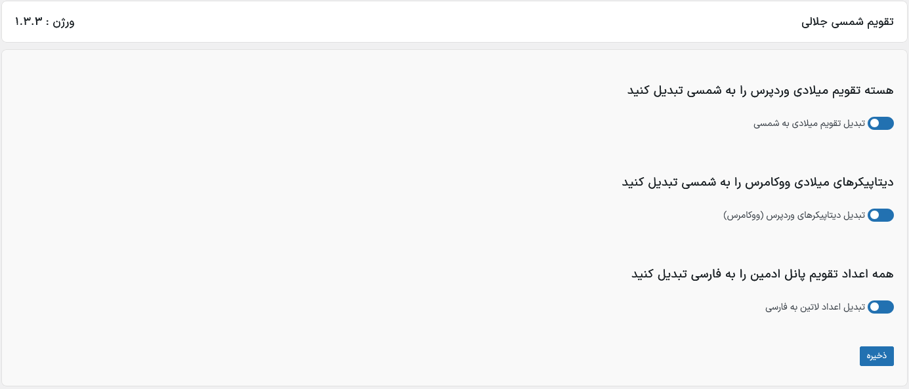
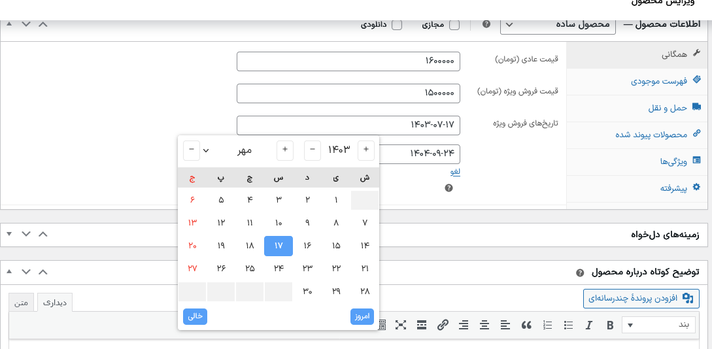

### LiteShamsi (Jalali Calendar Persian Date Converter) WordPress Plugin

In WordPress and WooCommerce, displaying the Shamsi (Jalali) date for us Iranians has always been a relatively challenging task. The plugins that have been released so far either don’t get updated or don’t correctly convert the Gregorian date to Shamsi, at least for the templates I’ve designed. Therefore, after conducting research and development, I created this lightweight plugin to ensure the date conversion is done correctly.

در وردپرس و ووکامرس، نمایش تاریخ شمسی برای ما ایرانیان همیشه چالشی نسبتاً دشوار بوده است. افزونه‌هایی که تاکنون منتشر شده‌اند یا به‌روزرسانی نمی‌شوند و یا تاریخ میلادی را به‌درستی به شمسی تبدیل نمی‌کنند، حداقل برای قالب‌هایی که من طراحی کرده‌ام. به همین دلیل، این افزونه نسبتا سبک و سریع را طراحی کردم تا تبدیل تاریخ به درستی انجام گیرد.
 

  
### دانلود افزونه لایت شمسی از مخزن وردپرس
[📥 دانلود افزونه لایت شمسی](https://wordpress.org/plugins/mo-jalali-calendar/)

## Features

- **Core WordPress Compatibility**: Effortlessly convert dates throughout the WordPress core to Persian dates.
- **WooCommerce Support**: Fully compatible with WooCommerce date pickers, providing a better experience for Persian-speaking customers.
- **User-Friendly Interface**: Easy to use and integrates seamlessly with existing WordPress themes and plugins.

## Installation from WordPress Repository

1. Go to your WordPress admin dashboard.
2. Navigate to `Plugins > Add New`.
3. In the search bar, type "**LiteShamsi**" or "**Jalali Calendar Persian Date Converter**".
4. Locate the plugin in the search results and click on **Install Now**.
5. Once installed, click on **Activate** to enable the plugin.

You can also download the plugin directly from the [official WordPress repository page](https://wordpress.org/plugins/mo-jalali-calendar/) and upload it manually:

1. Go to the [plugin page](https://wordpress.org/plugins/mo-jalali-calendar/) and click **Download**.
2. Save the zip file to your computer.
3. Go to your WordPress admin dashboard.
4. Navigate to `Plugins > Add New` and click **Upload Plugin**.
5. Choose the downloaded zip file and click **Install Now**.
6. After installation, click on **Activate Plugin** to start using it.

## Manual Installation

1. Download the plugin zip file.
2. Go to the WordPress admin area.
3. Navigate to `Plugins > Add New`.
4. Upload the downloaded zip file.
5. Activate the plugin.

## Usage

Once activated and with simple configurations completed, the plugin will automatically convert all Gregorian dates to Jalali dates in the WordPress core and WooCommerce date pickers. This process allows you to easily utilize Persian dates on your site.

## Contributing

This plugin is open source. If you would like to contribute to the development of the Persian Date Converter Plugin, please fork the repository and submit a pull request. Your feedback and contributions are greatly appreciated!

## Libraries Used

This plugin was built with the help of the following libraries:

1. [Jalali](https://github.com/rustinm/jalali): This package helps developers to easily work with Jalali (Shamsi or Iranian) dates in PHP applications, based on the Jalali (Shamsi) DateTime class.

2. [JalaliDatePicker](https://github.com/majidh1/JalaliDatePicker): A JavaScript date picker.

## License

This plugin is licensed under the GNU General Public License v2. See the [LICENSE](LICENSE) file for more information.

---

Thank you for using the Persian Date Converter Plugin! If you have any questions or need support, feel free to reach out.
